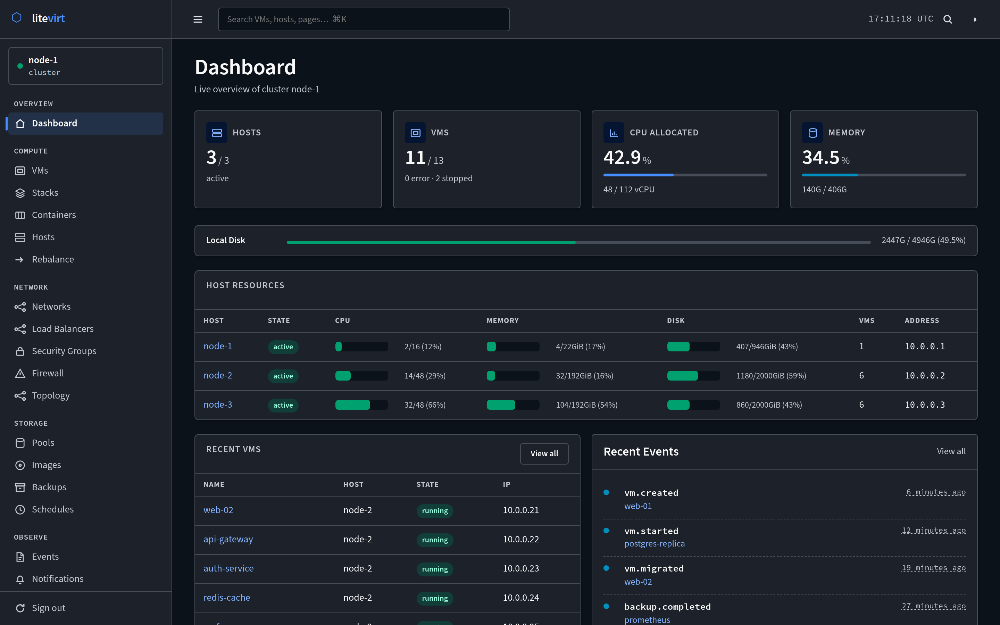
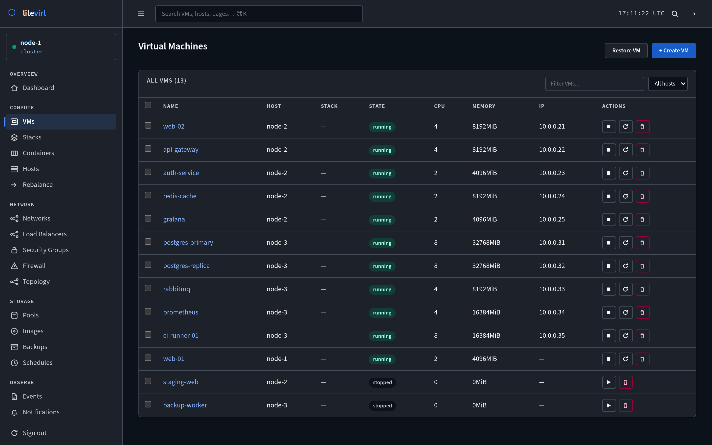
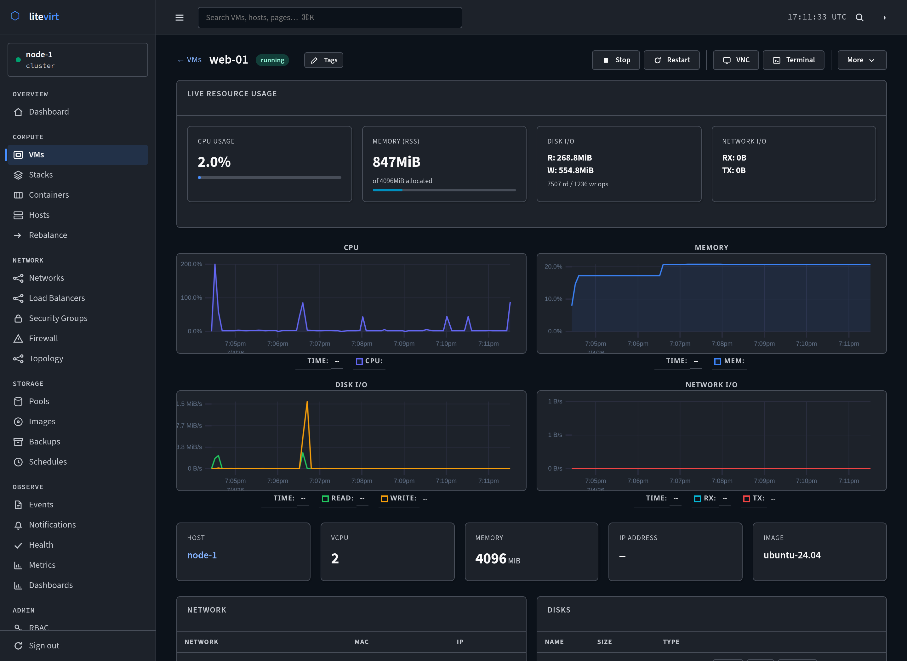
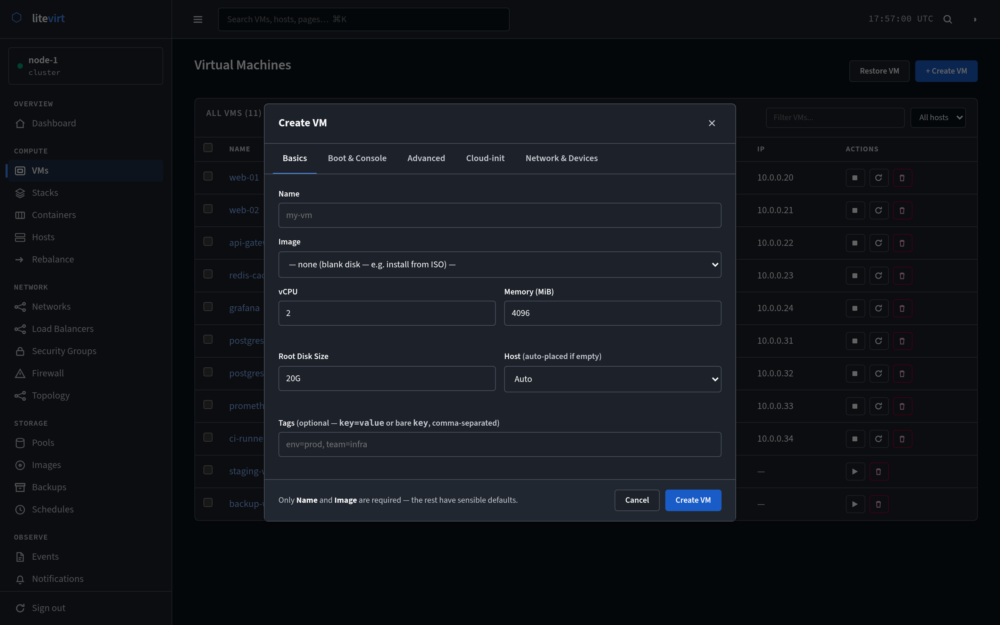

<p align="center">
  
</p>

# litevirt

<p align="center">
  <a href="https://github.com/colonelpanik/litevirt/actions/workflows/ci.yml"></a>
  <a href="https://github.com/colonelpanik/litevirt/releases/latest"></a>
  <a href="https://github.com/colonelpanik/litevirt/releases/latest"></a>
  
  
</p>

<p align="center">
  <b>Run real VMs across a cluster — from one static binary, with no master node.</b>
</p>

litevirt is a **masterless KVM/QEMU orchestrator**: `scp` one ~35 MB binary to each host and you
have a self-replicating cluster with live migration, automatic failover, snapshots, deduplicated
backups, and a web UI. No external database, no agents, no control-plane to babysit. The
post-Broadcom Proxmox alternative for homelabs, SMBs, and service providers.

<p align="center"><sub>
  Full KVM VMs · Live migration · Auto-failover · Snapshots &amp; backup · mTLS + RBAC · Compose-style YAML · Web UI &amp; REST API
</sub></p>

<p align="center">
  
</p>

<p align="center">
  
</p>

## Why litevirt?

|  | **litevirt** | Proxmox VE | bare libvirt | k8s + KubeVirt |
|---|:--:|:--:|:--:|:--:|
| Single static binary — no DB, no agents | ✅ | ❌ | ❌ | ❌ |
| Masterless — no central control plane | ✅ | ⚠️ corosync | n/a | ❌ etcd |
| Live migration (zero-downtime) | ✅ | ✅ | manual | ✅ |
| Automatic failover + fencing | ✅ | ✅ | ❌ | ✅ |
| Compose-style multi-VM YAML | ✅ | ❌ | ❌ | ⚠️ CRDs |
| Disk **and** live/RAM snapshots | ✅ | ✅ | ⚠️ | ⚠️ |
| Dedup backup + incremental replication (DR) | ✅ | ✅ | ❌ | ⚠️ add-on |
| GPU / PCI passthrough (+ hot-plug) | ✅ | ✅ | manual | ✅ |
| mTLS everywhere + RBAC + OIDC/LDAP + 2FA | ✅ | ⚠️ | ❌ | ✅ |
| Footprint | ~35 MB | full distro | library | heavy |

## Quick start

```bash
make build                                              # → bin/litevirt (+ bin/lv symlink)

# Single node (run on the host itself)
sudo cp bin/litevirt /usr/local/bin/
sudo ln -sf /usr/local/bin/litevirt /usr/local/bin/lv
sudo litevirt host init --local --name node-1
sudo systemctl enable --now litevirt.service

# Run a VM
export LV_HOST=root@127.0.0.1
lv image pull https://cloud-images.ubuntu.com/.../jammy-server-cloudimg-amd64.img --name ubuntu
lv run --name my-vm --image ubuntu --cpu 2 --memory 2048
lv ls
```

Add more hosts with `lv host init root@<ip> --name node-2` — they auto-join and start replicating.
Full walkthrough in [docs/installation.md](docs/installation.md).

## Features

| | |
|---|---|
| 🖥️ **Compute** | Full KVM/QEMU VMs (UEFI, cloud-init, VNC/SPICE, guest agent) · hot-plug disks/NICs/GPU · virtio memory ballooning · live **reconfigure** of CPU/restart-policy/autostart |
| 🌐 **Networking** | Bridge · VXLAN overlays · isolated networks · SR-IOV · built-in DHCP/DNS (dnsmasq) · NAT/SNAT · host isolation · embedded `<vm>.<stack>.<domain>` DNS |
| 🔁 **Resilience** | Live + cold + storage migration · quorum auto-failover with IPMI/watchdog fencing · per-VM **restart policy** · witness host for even-N clusters · safe self-upgrade with auto-rollback |
| 💾 **Data** | Disk + live/RAM snapshots · PBS-style deduplicated backups with guest fs-freeze · incremental volume replication + promote-on-fence (DR) · 8 storage drivers (local/dir/NFS/iSCSI/Ceph/ZFS/btrfs/LVM-thin) |
| 🧩 **Orchestration** | Docker-Compose-style multi-VM stacks · placement policies + anti-affinity · live rebalancer · HAProxy + keepalived L4 load balancing · GitOps reconcile loop · VM templates & clones |
| 📦 **Containers** | LXC/OCI containers — lifecycle + Compose · dedup backup/restore · snapshots · cold migration · templates & clones · host-loss relocation · shared tenancy quota, audit-chain & metrics |
| 🔐 **Security** | mTLS everywhere (auto ECDSA P-256 PKI) · path-based RBAC · Local/OIDC/LDAP realms · TOTP + WebAuthn 2FA · scoped API tokens · tamper-evident audit hash-chain |

Decentralized by design: every host is equal, state replicates via the **Crescent** protocol
(relay-quorum topology, wall-clock last-writer-wins on each row's `updated_at`, anti-entropy drift
detection) — scaling to hundreds of nodes with no master to lose.

<details>
<summary><b>More screenshots</b></summary>

<p align="center">
  <br>
  <em>Cluster-wide VM list</em>
</p>
<p align="center">
  <br>
  <em>Per-VM live metrics — CPU, memory, disk &amp; network</em>
</p>
<p align="center">
  <br>
  <em>VM creation — resources, boot, passthrough, cloud-init, networking</em>
</p>
</details>

## Documentation

| | |
|---|---|
| [Installation](docs/installation.md) | Build, bootstrap a cluster, add hosts |
| [CLI Reference](docs/cli-reference.md) | All `lv` commands and flags |
| [Configuration](docs/configuration.md) | Daemon config reference |
| [Compose Stacks](docs/compose.md) | Multi-VM YAML, restart policy, update strategy |
| [Networking](docs/networking.md) | Bridge, VXLAN, SR-IOV, IPv6 |
| [Storage](docs/storage.md) | Local, NFS, Ceph, iSCSI backends |
| [Migration & Failover](docs/migration-failover.md) | Live migration, health checks, fencing, witness |
| [Placement & Rebalancer](docs/placement.md) | Policy axes, named modes, scope chain |
| [Upgrades](docs/upgrades.md) | Pre-flight gates, upgrading state, auto-rollback |
| [Operating Model](docs/operating-model.md) | Cluster guarantees, recovery playbook |
| [GPU & PCI Passthrough](docs/pci-passthrough.md) | Device assignment, SR-IOV, hot-plug |
| [Containers (LXC/OCI)](docs/containers.md) · [REST API](docs/rest-api.md) · [Web UI](docs/ui.md) · [Notifications](docs/notifications.md) | |

## Build & test

```bash
make build   # single binary bin/litevirt (~35 MB, static, no CGO) + bin/lv symlink — Go 1.25+
make test
```

`litevirt daemon` runs the server; `litevirt <cmd>` (or `lv <cmd>`) is the CLI. Ports: `7443`
gRPC/mTLS · `7444` metrics · `7445` web UI · `7446` REST · `7946` cluster membership.
